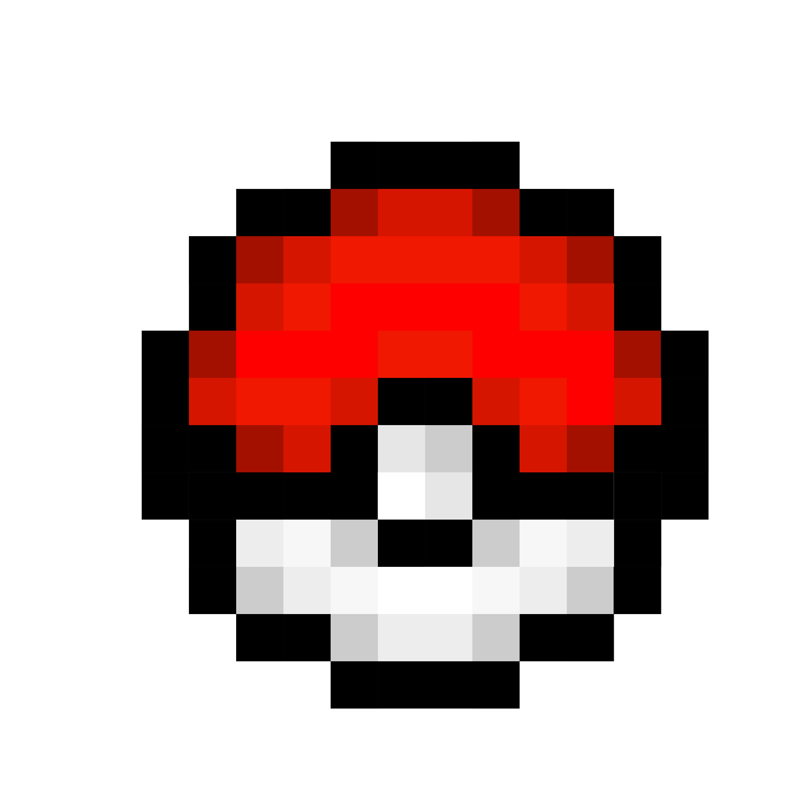

# PokeDexTop : A Desktop National Pokedex 

A National Pokedex for Pokemon TCG Collectors. Add cards to a your collection from current and vintage sets, and build your dream national pokedex collection without redudndant websites and information.    

Upon a friend group challenging eachother to cultivate a TCG national pokedex generation by generation over months per gen, I was inspired to code a digital binder to track, display, search, and share admirable TCG cards and binder pages. 

## Features

- A digital binder organized by Pokedex number and split into generations.
- A 'Search by Set' tab that allows you to browse through TCG sets.
- A 'Search by Pokemon' tab that allows you to search for all cards pertaining to certain Pokemon.
- A button to add cards from either Search tabs to your digital binder.

## Features to Work on (Refer to Issues)

- Hover and examine cards for further detail.
- Remove existing cards in your digital binder.
- Select and export by multiple individual cards with their names/numbers or by generation page.

## Advantages of a Desktop Application

Better Performance: Direct access to system resources. No HTTP overhead or browser rendering limitations. Faster image loading and display

Richer User Experience: Native UI components and interactions. More responsive interface. Better integration with the operating system

Offline Functionality: Works completely offline with no web server needed. Simpler deployment for end users

Enhanced Features: Direct filesystem integration for importing/exporting data. Ability to use system dialogs for file selection. Potentially faster image processing and caching

## Potential New Challenges

Cross-Platform Compatibility: Ensuring consistent look and behavior across operating systems. May need to handle platform-specific quirks

Distribution and Updates: Need to build separate executables for different platforms. Updates require users to download and install new versions. May need an auto-update system

Deployment Size: Executable size will be larger as it includes Python and all dependencies
May require an installer for proper setup

